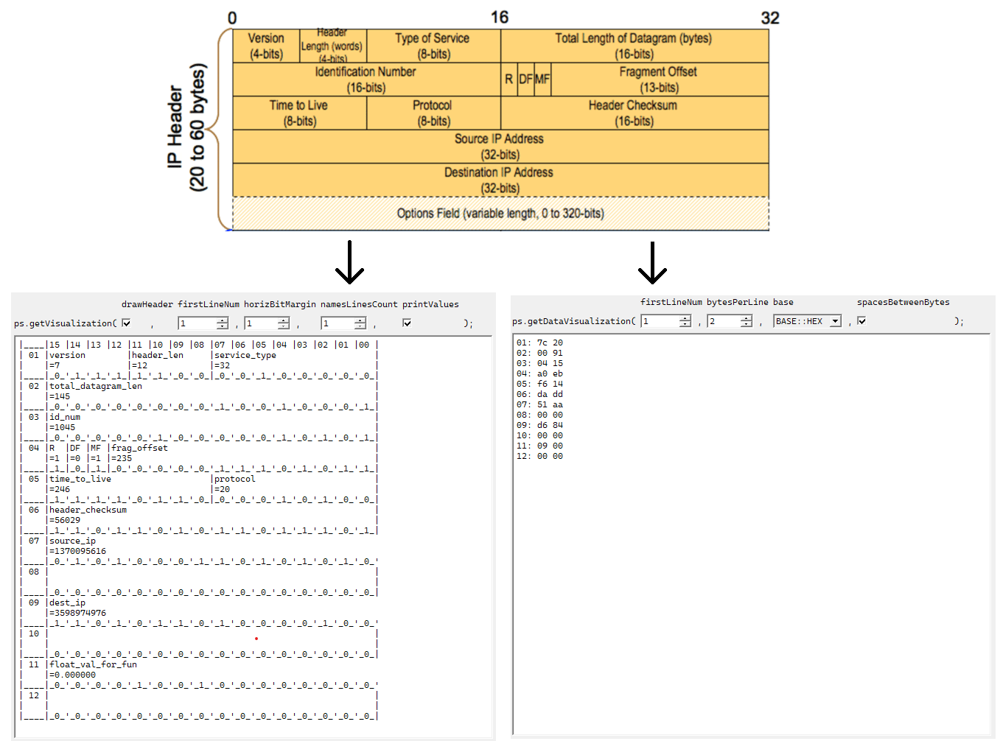
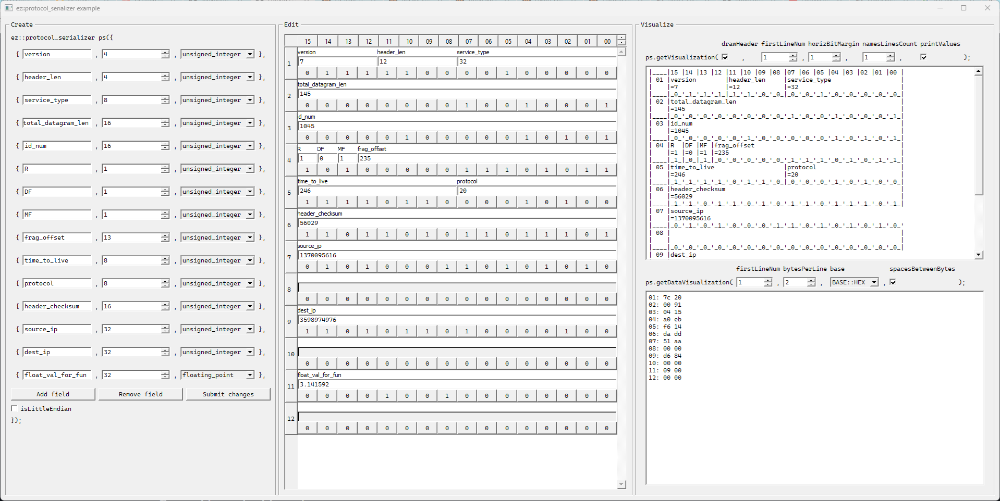

# EzProtocolSerializer
`EzProtocolSerializer` is a poweful C++ serialization tool which is capable of `reading/writing` values to/from binary buffer in compliance with established protocol with respect to `byte order of host` aswell as specified `byte order of a protocol`. Apart from reading and writing capabilities, `EzProtocolSerializer` provides a couple of powerful tools for `buffer visualization`, which can be very useful for debugging binary data.

## Visualization Output Sample (screenshots from example application)


# Table of Contents
- [Key Features](#key-features)
- [Building](#building)
  - [Building EzProtocolSerializer Class](#building-ezprotocolserializer-class)
  - [Building Example Application](#building-example-application)
  - [Building Tests](#building-tests)
- [EzProtocolSerializer Class Reference](#ezprotocolserializer-class-reference)

# Key Features
- Reading/writing of any arithmetic values: `float`, `double`, `int8_t`, `int16_t`, `int32_t`, `int64_t`, `uint8_t`, `uint16_t`, `uint32_t`, `uint64_t`)
- Possibility to set specific `byte order` for multi-byte values which identifies how value should be written to or read from buffer.
- Automatic conversions in case `host machine byte order` differs from `protocol byte order`.
- Works with both `internal` (automatically-managed according to current protocol) and `external` buffers.
- Possibility to write whole `arrays` of values at once.
- Possibility to write or read values while `deviating` from a given protocol (manually specifying first bit and bit count to read/write instead of a `field name`).
- Two flexible visualization methods:
  - Detailed `field-level` visualization (`get_visualization()`).
  - General `byte-level` visualization with 4 bases of choice: `bin`, `oct`, `dec`, `hex` (`get_data_visualization()`).
- `Error codes` system which describes whether specific operation was succesfull or not (there are some natural limitations of what you can create, read etc.)
- `Strong test-coverage` of reading and writing algorithms. Tested on both `little-endian` and `big-endian` environments.
- Predictable `type-narrowing` behavior which mimics the one C++ narrowing - "cutting off most significant bits until it fits" :).
- No dependencies.
- Can be easily adapted for `C++11` if needed.
- Can be made faster with `C++17` if needed.

# Building

## Building EzProtocolSerializer Class
### Prerequisites
- C++14 or newer

Since it is a simple C++ class with no additional dependencies, just add `ez_protocol_serializer.h` and `ez_protocol_serializer.cpp` to your project and use it.

## Building Example Application


Example application is a Qt GUI application which demonstrates most (but not all) important features of `EzProtocolSerializer`. It lets you play around with field definitions, protocol endiannes, values and visualization parameters. This way it is easy to explore and make a decision of whether it fits your needs. Building steps may differ depending on `CMake generators` you have set up.
### Prerequisites
- CMake
- Qt5 or newer
- C++14 or newer

### General Linux Building Steps
```sh
git clone ...
cd EzProtocolSerialzer/example
cmake CMakeLists.txt
make
./EzProtocolSerializer
```

### General Windows Building Steps
```sh
git clone ...
cd EzProtocolSerialzer/example
cmake CMakeLists.txt
```
Open generated `EzProtocolSerializerExample.sln` and build solution. Run.

### Build Troubleshooting
Most possible problems might be:
- Qt is not correctly set up in your `PATH` which prevents `CMake` from locating required Qt cmake modules.
Solution: you may just add this line at the top of `CMakeLists.txt` (replace with your actual path):
```cmake
set(CMAKE_PREFIX_PATH <path_to_qt>/Qt/<qt_version>/<compiler>/lib/cmake)
```
> **Note:** It is very important to place this before `find_package` commands which look for `Qt`.
- After building on Windows, running an application causes errors regarding not found `.dlls`

Solution:
- Copy `QtXCore.dll`, `QtXCored.dll`, `QtXGui.dll`, `QtXGuid.dll`, `QtXWidgets.dll`, `QtXWidgetsd.dll` from `<path_to_qt>/<qt_version>/<compiler>/bin` next to compiled example application executable (might be inside `EzProtocolSerializer/example/bin/<build_type>/`).
- Also copy whole `<path_to_qt>/<qt_version>/<compiler>/plugins/platforms` folder next to example application executable.
> **Note:** `X` stands for Qt version you have (can be 5, 6 or later).

> **Note:** It is technically enough to copy either only release (without `d` postfix) or only debug (with `d` postfix) dlls.

> **Note:** Modern `Qt Creator` allows you to just open `CMakeLists.txt` without running `cmake`. Open it, configure a project there and build. This way will also not require copying any `.dlls` or `platforms`.

## Building Tests
Steps may differ depending on `CMake generators` you have set up.
### Prerequisites
- CMake
- GTest

### General Linux Building Steps
```sh
git clone ...
cd EzProtocolSerialzer/tests
cmake CMakeLists.txt
make
./EzProtocolSerializerTests
```

### General Windows Building Steps
```sh
git clone ...
cd EzProtocolSerialzer/tests
cmake CMakeLists.txt
```
Open generated `EzProtocolSerializerTests.sln` and build solution. Run.

# EzProtocolSerializer Class Reference
Trying not to blow up this page by describing every single tiny detail, I will just cover important topics.
Not mentioned methods should be self-explanatory and easy to understand just by looking at them in the header file.

## Protocol Specification

### General Rules
There are some natural limitations to what you can and can not create:
- There are no limitations to where field starts and ends, meaning it is never required to be perfectly aligned or smth.
- You are free to create as long fields as you want. But it is not possible to write or read from a field which is longer than 64 bits. You can still create very long fields in case you would want to read or write an `array` into it so that every element will actually take up <= 64 bits.
- You can not specify `floating_point` visualization type for fields with length not equal to 32 or 64 bits.
- In case protocol is set to be in `little-endian`, you can not create fields with bit count of < 8 and not devisible by 8 simultaneously. So, allowed lengths would be, for example, `1`, `5`, `8`, `16`, `24` etc. Not allowed lengths would be: `15`, `28`, `56` etc. This is due to weird gaps which will happen in memory if you write such fields. In my practice I have never met a single little-endian based protocol which looks like that. That is probably why :)
- Almost every method is quipped with either returned or passable-by-pointer `protcol_serializer::result_code` object. You may want to use it to ensure you don't skip any error.

### Variant 1
```C++
// Creating an object which will create some data from scratch.
// Protocol parameters:
// - "false" - means not little endian. So protocol writes multi-byte integer values to buffer according to big-endian.
// - "protocol_serializer::buffer_source::internal" - means that reading and writing happens to internal buffer which is always synced in size with sum of all protocol fields.
//   It is kept synced in size (but not data) even if current working buffer is buffer_source::external
// Field parameters:
// - First parameter is a name
// - Second parameter is bit count (1 <= bitCount <= 64)
// - Third parameter is optional and is needed to correctly print out values during "protocol_serializer::get_visualization()"
//   call in case values are requested to be printed there. It does not affect reading or writing.
using vis_type = ez::protocol_serializer::visualization_type;
protocol_serializer creator({
                                {"version", 4},
                                {"header_len", 4},
                                {"service_type", 4},
                                {"total_datagram_len", 4},
                                {"id_num", 4},
                                {"R", 4},
                                {"DF", 4},
                                {"MF", 4},
                                {"frag_offset", 4},
                                {"time_to_live", 4},
                                {"protocol", 4},
                                {"header_checksum", 4},
                                {"source_ip", 4},
                                {"dest_ip", 4},
                                {"float_val_for_fun", 32, vis_type::floating_point}
                            }, false, protocol_serializer::buffer_source::internal);

creator.write("version", 3);
creator.write("header_len", 4);
// Write resulting bytes into socket
writeToTcpSocket(creator.get_working_buffer(), creator.get_internal_buffer_length());
// We may also read values back:
unsigned int version = creator.read<unsigned int>("version");
float fun = creator.read<float>("float_val_for_fun");
```

### Variant 2 (may be combined with Variant 1 and vise-versa)
```C++
protocol_serializer creator(false, protocol_serializer::buffer_source::internal);
creator.append_field({"field_1", 3, protocol_serializer::visualization_type::signed_integer});
creator.append_field({"field_2", 53, protocol_serializer::visualization_type::unsigned_integer});
creator.remove_last_field();
creator.remove_field("field_1");

// Important note: protocol layout-affecting methods have an optional parameter preserve_internal_buffer_values = true.
// This parameter sets wheter current internal buffer values should be copied into new internal buffer (with new updated size)
// In case it is false, all bytes of internal buffer will be set to 0.
```
See also: `append_protocol()`, `clear_protocol()`, `set_is_little_endian()`, `set_buffer_source()`, `set_external_buffer()` etc.

## Writing

### General Rules
- Written type T must meet `std::is_arithmetic<T>` trait.
- Regardless of whether you pass `float` or `double`, the value will be written as `double` in case you write into a field of `64` bits and as `float` in case of a `32`-bit field.
- In case field bits are physically not capable of holding some bigger integer value, then written values most significant bits are cut until it fits into the field.
- When writing arrays, field length should be equally divisible by N

### Writing Regular Values
```C++
protocol_serializer ps({
                            {"field_1",1},
                            {"field_2",4},
                            {"field_3",5},
                            {"field_4",6},
                            {"field_5",32}
                       });
ps.write("field_1", 1);
ps.write("field_2", 5);
ps.write("field_3", 12);
ps.write("field_4", 60);
ps.write("field_5", 3.1415f);
```

### Writing Arrays
```C++
// Create a field of 32 bits
protocol_serializer ps({
                            {"array_of_8_ints",32}
                       });
int array_of_ints[8];
// Write into "array_of_8_ints", resuting in 8 integers (4 bits each) being written
ps.write_array<int>("array_of_8_ints", array_of_ints, 8);
```
See also `write_ghost`, `write_ghost_array` which let you write into specific buffer space by specifying start bit and bit count instead of a field name.

## Reading
### General Rules
- Read type T must meet `std::is_arithmetic<T>` trait.
- Regardless of whether you pass `T = float` or `T = double`, the value will be read as `double` in case you read a field of `64` bits and as `float` in case of a field of `32` bits. The conversion to actual `T` will happen as the last step.
- In case passed `T` is physically not capable of holding field value, then read values most significant bits are cut until it fits into the `T`.
- It is `very` important to keep track of wheter you read into `signed` or `unsigned` `T`.
  - In case you read into `signed T`, then if fields most significant bit (possiby after narrowing described in previous point) is `1`, then the value is interpreted as a negative value according to `two's complement` method of representing negative values.
  - In case you read into `unsigned T`, then value is read as `unsigned`.
 
```C++
// Let's demonstrate how sign of T affects resulting value
protocol_serializer ps({
                            {"bits_are_111",3}
                       });
// Make 3-bit value to hold all bits equal to 1.
ps.write("bits_are_111", 7);
int signed_value = ps.read<int>("bits_are_111"); // signed_value = -1
unsigned int unsigned_value = ps.read<unsigned int>("bits_are_111"); // unsigned_value = 7
```

### Reading Regular Values

### Reading Arrays

See also `read_ghost`, `read_ghost_array` which let you read specific buffer space by specifying start bit and bit count instead of a field name.